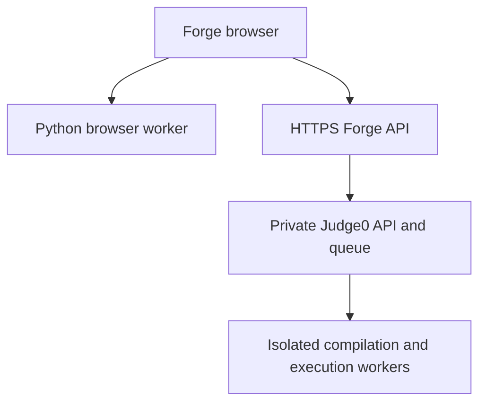

# Forge v2: C/C++ execution and curriculum

## 1. Execution architecture

The website remains a static GitHub Pages application. Python keeps its existing browser worker. C17 and C++17 use the new Node.js 24 API in [`backend/server.mjs`](backend/server.mjs), which sends work to a separately hosted Judge0 service. GitHub Pages publishes the learning interface; it cannot host this API or a native compiler.



The Forge API validates and authenticates requests, selects fixed compiler flags and resource limits, creates an opaque job ID, and returns immediately. It polls Judge0 asynchronously and exposes bounded results. Its code never invokes a shell, compiler, user executable, or Docker socket. Judge0 performs **both compilation and execution inside its sandbox**; compiling hostile source is itself untrusted work. The asynchronous submission and polling contract follows the [Judge0 API](https://ce.judge0.com/).

The supplied Dockerfile packages only the gateway. A container alone is not the execution security boundary. Use a maintained Judge0 deployment with isolate and cgroups on dedicated worker infrastructure, preferably disposable VMs for additional separation. Keep the worker host separate from application data and production secrets. Consult [isolate's security model](https://github.com/ioi/isolate) and [Judge0 security advisories](https://github.com/judge0/judge0/security/advisories) when selecting and pinning a release; an old tutorial image is not a patch policy.

### What the gateway enforces

| Control | Implemented policy |
| --- | --- |
| Authentication | Random personal bearer token, constant-time digest comparison |
| Browser access | Exact origin allowlist; no credential cookies or wildcard CORS |
| Input | Only `language`, `source`, `stdin`; no custom flags, paths, callbacks, arguments or archives |
| Language | Server-configured GCC IDs checked against provider `/languages` |
| Standards | `-std=c17` / `-std=c++17`, `-O2 -Wall -Wextra` |
| Request sizes | 64 KiB request, 32 KiB source, 16 KiB stdin; UTF-8 byte limits |
| Program CPU | 2 seconds, with 0.25-second extra time for termination/reporting |
| Program wall clock | 5 seconds |
| Program memory / stack | 256 MiB / 16 MiB |
| Program processes | 4; limits apply to the job rather than independently multiplied per process |
| Program files | 64 KiB per file; worker storage quotas are additionally required |
| Program network | `enable_network: false`; provider network default must also be false |
| Gateway admission | 2 active tracked jobs; 10 submission attempts and 180 authenticated requests per fixed minute window |
| Response bounds | 512 KiB upstream JSON maximum; 64 KiB decoded per output stream |
| Results | At most 64 retained jobs; finished results expire after 10 minutes on access |
| Provider requests | 8-second individual timeout; 60-second polling deadline, plus any in-flight request |

Rate limits are deliberately small for one person's practice. Fixed minute windows can allow a burst across a minute boundary. Admission is reserved before reading a submission body. The worker queue and global worker count must also be capped: a disconnected browser or timed-out gateway does not cancel already queued provider work.

A program's memory failure may be reported as a signal or runtime error by Judge0; Forge does not invent a more specific verdict. `completed` means execution finished, **not** that a hidden-test judge accepted the algorithm. Compiler errors, program time limits, runtime failures and service outages have separate statuses. Oversized provider responses become a bounded service error instead of being loaded without limit.

### What deployment must enforce

Place the API behind HTTPS and an ingress with connection, request-body, slow-client and unauthenticated traffic limits. Bind its container to loopback as supplied. Limit gateway outbound traffic to the configured provider, DNS and necessary infrastructure. Do not expose Judge0, Redis or its database directly to public clients; require authentication between gateway and provider.

Workers need functioning namespaces/cgroups, no network egress from jobs (including metadata/private networks), isolated temporary directories, clean-up, disk/inode quotas and no host or Docker-socket mounts available to submissions. Configure a bounded worker queue and concurrency. Set a per-job writable-storage budget and a worker disk budget in the host's filesystem policy; the submission's per-file size limit alone does not bound many small files. Verify these controls on the actual host before allowing submissions.

[`backend/judge0-policy.env.example`](backend/judge0-policy.env.example) contains the required execution defaults and bounded compilation maxima. Apply them to the **separate Judge0 server and workers** alongside that release's required database and authentication configuration. `MAX_*` values give compilation a larger budget: up to 15 seconds CPU, 20 seconds wall, 512 MiB memory, 128 MiB stack, 64 processes and 4 MiB per file. This separation follows Judge0's [compilation worker implementation](https://github.com/judge0/judge0/blob/master/app/jobs/isolate_job.rb). Verify your pinned release uses equivalent isolation for compilation; these are not extra compiler limits enforced by the Node container.

Readiness checks reject missing/excessive provider maxima and a network-enabled or unknown network default. They verify advertised configuration, not host isolation. A provider with incompatible limits must be configured to this profile before startup succeeds. Also verify CPU-burning, sleeping, excess allocation, process creation, excessive output, file access, network denial and compilation exhaustion in a controlled staging sandbox. The automated tests in this repository do not establish kernel isolation.

## 2. Backend code and API routes

The full implementation is [`backend/server.mjs`](backend/server.mjs), with no runtime npm dependencies. See [`tests/backend.test.mjs`](tests/backend.test.mjs) for HTTP and provider contract tests.

| Route | Request | Response |
| --- | --- | --- |
| `GET /healthz` | No credentials | Readiness information |
| `GET /v1/languages` | Bearer token | C/C++ labels, actual compiler versions and fixed limits |
| `POST /v1/submissions` | Bearer token and JSON below | HTTP 202 with opaque job `id`, status and polling interval |
| `GET /v1/submissions/:id` | Bearer token | Pending status or terminal result |

```json
{
  "language": "cpp",
  "source": "#include <iostream>\nint main(){ std::cout << 19 << '\\n'; }",
  "stdin": ""
}
```

Use `"c"` for C17. No execution-control fields from the browser are accepted. A typical terminal result contains:

```json
{
  "id": "a-server-generated-uuid",
  "language": "cpp",
  "status": "completed",
  "done": true,
  "stdout": "19\n",
  "stderr": "",
  "compileOutput": "",
  "outputTruncated": false,
  "timeSeconds": 0.01,
  "memoryKb": 1000,
  "exitCode": 0
}
```

Missing/expired IDs return 404; invalid input 400; unsupported content type 415; oversized body 413; missing token 401; disallowed origin 403; admission/rate limit 429. Poll until `done` is true. The website's **Stop waiting** stops browser polling; the worker still finishes or reaches its limits.

### Deploy and connect

1. Provision and secure the compatible Judge0 service above. Obtain its `/languages` response and select the GCC C and C++ IDs; IDs are not assumed universal.
2. On a separate API host, copy `backend/.env.example` to `backend/.env`. Generate `FORGE_API_TOKEN` with `node -e "console.log(require('crypto').randomBytes(32).toString('hex'))"`. Set the server-only Judge0 credential independently, its HTTPS URL, language IDs and `FORGE_ALLOWED_ORIGINS=https://axsimarosmelos.github.io`. CORS origins have no `/forge/` path.
3. Start with Node 24: `node --env-file=backend/.env backend/server.mjs`. Alternatively, from `backend`, use `docker compose up -d --build`. Startup fails closed if provider configuration is incompatible. The Docker Compose service is the gateway only.
4. Point a domain at this API host and configure HTTPS. [`backend/Caddyfile.example`](backend/Caddyfile.example) shows the proxy address and request cap; add host-level ingress/connection controls suitable for your environment. The API's default loopback binding is intended for this proxy.
5. In Forge, open **Code lab → C++17 → Connect compiler service**. Enter the Forge API HTTPS address and **Forge personal token**. Never enter the Judge0 credential in the website. The token stays in this tab's memory, and must be reentered after reload. Connecting sends it only to the chosen address; changing/importing the saved service URL clears the connection.
6. Run the starter (`7 12` → `19`) and a deliberate syntax error. Then verify the staging sandbox checks above before treating execution as ready.

The website and source can be published independently of this deployment. Until an API/provider is deployed and connected, C/C++ lessons, editing, syntax highlighting, downloads and recall work, while the native Run button is unavailable. Python uses its existing runner.

### Scope and data lifecycle

This is a **single-owner service**, with one credential and one process. Run one gateway replica. In-memory quotas and job ownership are not a multiuser system. Before sharing a public service, add account authentication, per-user ownership checks, distributed quotas and durable job storage. Do not distribute this personal token to a classroom.

The gateway does not log request source, stdin or credentials. It keeps bounded results temporarily in memory. Judge0 has its own database and retention policy: configure submission deletion/retention and log redaction there. A gateway restart loses results but may leave provider work running. Backups contain learning progress, drafts and the service address; browser-created backups never contain connection credentials. Shared-origin JavaScript can access tab memory, so keep this Pages origin and its scripts trusted.

## 3. Curriculum JSON and frontend integration

[`content/curriculum.json`](content/curriculum.json) is the complete, generated structure: **9 modules, 91 topics**. It covers C foundations, C++ foundations, STL, algebra, data structures, dynamic programming, strings, graphs and geometry. All topic dependencies are validated as an acyclic graph.

There are **13 complete lessons**: six in C, six in C++, and the full STL/fast-I/O module. The other **78 entries are explicit advanced study blueprints**, with objectives, prerequisites, a derivation/proof/implementation sequence, complexity targets, pitfalls, independent-oracle practice, mastery criteria, recall prompts and external references. The request's advanced curriculum structure is provided; these entries are not presented as 78 finished textbook chapters. The original content is inspired by the topic coverage at [cp-algorithms](https://cp-algorithms.com/), with links to original articles rather than copied chapters.

Example entry shape (abbreviated):

```json
{
  "id": "segment-tree",
  "title": "Segment trees",
  "language": "cpp",
  "content_status": "blueprint",
  "prerequisites": ["prefix-cpp"],
  "objectives": ["Define the aggregate and merge identity before writing a tree."],
  "study_outline": [
    {"step": "Model", "task": "Specify the query and update operations."},
    {"step": "Prove", "task": "Explain why merging child answers gives the parent answer."}
  ],
  "complexity": {"time": "O(n) build; O(log n) point update and range query", "extra_space": "O(n)"},
  "recall_cards": [{"q": "What must a merge operation satisfy?", "a": "Associativity, with an identity for empty contributions."}]
}
```

The actual JSON includes the full six-step outlines, exercise instructions and additional fields. Regenerate it with `python3 scripts/generate_curriculum.py`.

[`frontend/native.js`](frontend/native.js) extends the existing HTML app; no framework rewrite or third-party editor runtime is needed. It adds:

- Python/C17/C++17 language switching, separate saved source/input drafts and safe C/C++ token highlighting over an accessible textarea.
- Compiler connection, asynchronous submission/polling and separate compiler/stdout/stderr/status presentation.
- C and C++ learning tracks and a searchable-by-module algorithm atlas.
- Prerequisite-gated lesson completion and cards in the existing spaced-review deck. Incorrect checks add a repair card; independent practice is still needed to establish application skill.
- Existing progress/backups retained, including support for backups created before the native-language extension.

The current daily recommendations remain based on the Python course. The C/C++ tracks select readiness by their own prerequisites and share the review queue; they do not yet replace the Python daily roadmap or automatically judge Codeforces/LeetCode submissions. The 91-topic map is long-term reference material, not a promise of advanced mastery in 20 or 40 days.

## 4. First complete module and templates

Read [`content/cpp-stl-fast-io.md`](content/cpp-stl-fast-io.md): **C++ STL for Competitive Programming & Fast I/O**. It explains fast streams, numeric ranges, safe aliases/macros, vector size/capacity, iterator invalidation, sorting, strict comparators, bounds, ordered/unordered containers, heaps, queues and standard algorithms. It includes complexity comparisons, recall exercises and the original **Scoreboard Thresholds** problem with constraints, samples, hints, proof, solution and boundary tests.

Downloadable source files:

- [`templates/cpp17-starter.cpp`](templates/cpp17-starter.cpp)
- [`templates/c17-starter.c`](templates/c17-starter.c)
- [`templates/stl-workbench.cpp`](templates/stl-workbench.cpp)
- [`templates/scoreboard-thresholds.cpp`](templates/scoreboard-thresholds.cpp)

## Build and validation

Use Node 24, Python 3, GCC and G++:

```sh
npm install
npm run build
npm test
```

`marked` is a pinned **build-only** Markdown dependency. The compiled `index.html` embeds both curricula, the STL article, styles and application code, so Pages needs no build server. Edit `frontend/base.html` for the original app, `frontend/native.js` / `.css` for native-language UI, the curriculum generator for data, and the Markdown for the STL lesson. Rebuild and commit the generated `index.html` and JSON with source changes.

Tests exercise the HTTP API using a fake Judge0, legacy and new frontend state/rendering in a DOM stub, acyclic dependencies, all 13 trusted native lesson examples, four templates and the practice solution against 103 independent brute-force cases. They do not run attacker code locally. Browser visual behavior, the external Python runtime and real Judge0 host isolation require deployment/browser verification; this environment did not have those runtimes or a configured provider.
